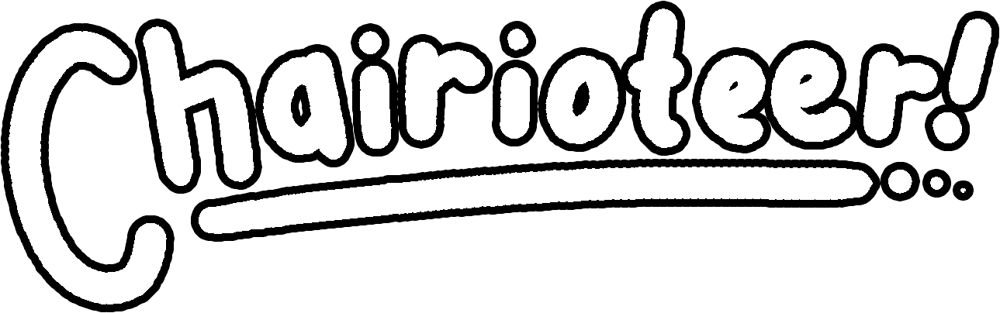

# chariot

> aaron was here
> nick was here too
> ronak popped in
> alistair is shockin em


## what is this?

chairiot is a 3d networked game, built from scratch in rust. It was made as part of [cse 125](https://cse125.ucsd.edu/), and was made over the course of 10 weeks.



## how do I run this?

For Windows, you can check the latest [release builds](https://github.com/ucsd-cse125-sp22/cse125-sp22-group1/actions/workflows/release.yml). 

For all platforms, you can pull and build the latest code. You'll need to download the latest tracks from the [chaired drive](https://drive.google.com/drive/folders/1CDamUs4vD-82Iznqz1p0YjVacxm2wBK5?usp=sharing), and put it in `tracks/track.glb`

```bash
git clone https://github.com/ucsd-cse125-sp22/cse125-sp22-group1 chairiot
cd chairiot
# put the map in the right folder
mkdir track.glb
mv path/to/track/glb tracks/track.glb
# in one shell, run the server
cargo run --manifest-path chariot-server/Cargo.toml --release # run in release for best performance
# in another shell, run the client
cargo run --manifest-path chariot-client/Cargo.toml --release # run in release for best performance
```

Create a `config.yaml` to specify a different port, if you want to run it on different machines.

## how did we build this?

With rust. More info tbd.

### components

1. [chariot-client](chariot-client) - graphics and input game engine
2. [chariot-server](chariot-server) - game simulation and networking
3. [chariot-core](chariot-core) - any common game structures / functions
4. [chariot-web](chariot-web) - minimalist web interface for harassing players


### development process
1. Please Git Pull Immediately
2. Push your branch asap (name it `yourname/feature`)
3. Make a Draft PR of your branch as soon as you do so (yes, even if it's not really done, that's why it's in draft)
   1. this avoids accidental cross-work

### team mascot


## who made this?
- [Aaron James Eason](https://github.com/KNOXDEV)
- [Alistair Gray](https://github.com/alistairgray42)
- [Josh Cross](https://github.com/TheCrossBoy)
- [Nick Nebel](https://github.com/nickwn)
- [Jack Yang](https://github.com/caIcutec)
- [Peter Liu](https://github.com/potor10)
- [Ronak Shah](https://github.com/trulyronak)
